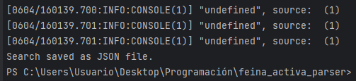
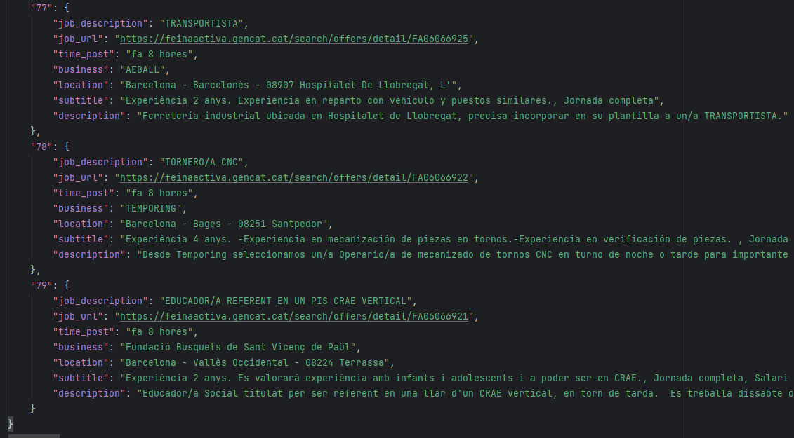

## Feina Activa (Servei d'Ocupació de Catalunya) CLI Job Scraper ##


This is a CLI based application made to parse jobs from the official webpage of Generalitat de Catalunya.

### Prerequisites ###

- Having the requirements installed (Selenium and BeautifulSoup).
- Having the webdriver downloaded and/or set to PATH, for the specific navigator. In my case I set it to Chrome.

### Arguments ###

The command line currently takes up to 4 arguments, two of them being mandatory (*output_path* and *results*), and,
at least, one of the remaining, *topic* and *province*.

- **output_path**: Absolute (preferably) path to stores JSON outputs.
- **results**: Integer for the number of results. Should be a divisor of 20 (each web updates increases the amount of jobs shown by 20).
- **topic**: Keyword/s used to search for specific words. If there is more than one, they should be space-separated and in quotes.
- **province**: Can be none, or one of the four catalan provinces (Barcelona, Girona, Tarragona, Lleida).

### Example ###

```
python .\main.py C:\feina_activa_parser\searchs --province barcelona --results 80
```
**Command line output**:



**JSON file**:



Results are indexed, starting from 0 as usual (80, in this example).
